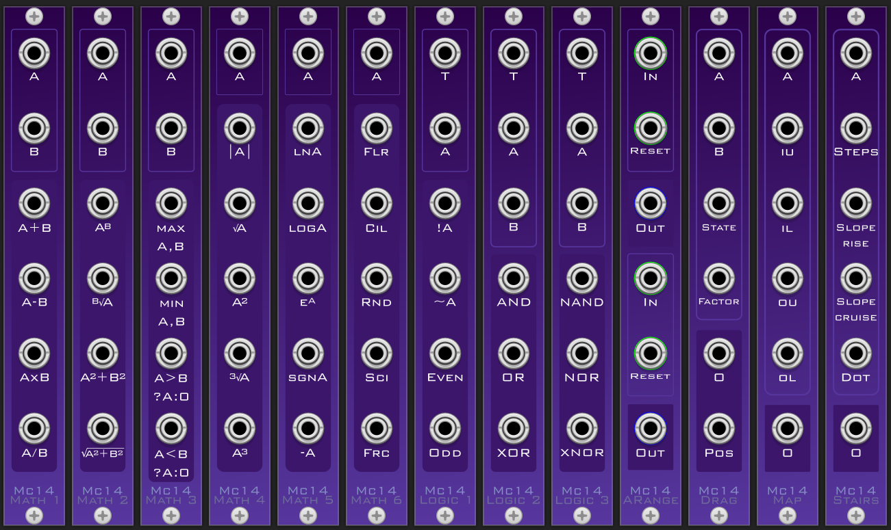

# Mathobiz
### A set of mathematical modules

 
 
 
## Featured Modules

### 1. Module: ARange - Automatic Range
    * Automatically maps the input to [-1, 1] range by deciding suitable offsets and scales.
    * Inputs and outputs of A and B are independent.

### 2. Module: Drag
    * If state is positive, it interpolates towards B.
    * If state is negative, it interpolates towards A.
    * Factor decides how fast it will interpolate.

### 3. Module: Map
    * Given the parameters IU, IL, OU and OL, 
      it shifts A from the range [IU, IL] to [OU, OL].
 
### 4. Module: Stairs
    * Divides an input A of the range [0, 1] into steps in the range [-1, 1].
    * Steps input decides the number of steps the stair will have.
    * Slope Rise decides how steep the wall of a step will be. [0->most steep]
    * Slope Cruise decides how steep the floor of a step will be. [0->least steep]
 
## Basic Modules

### 1. Module: Math_1 
    * Sum
    * Difference
    * Product
    * Division
    
### 2. Module: Math_2 
    * A raised to the power B 
    * Bth root of A
    * Sum of Squares
    * Root of Sum of Squares
    
### 3. Module: Math_3
    * Maximum 
    * Minimum
    * If A is greator than B, output A, else 0
    * If A is lesser than B, output A, else 0
    
### 4. Module: Math_4
    * Mod (or Absolute) value of A
    * Square Root
    * A Square
    * Cube Root
    * A Cube
    
### 5. Module: Math_5
    * Natural Logrithm
    * Logrithm Base 10
    * Exponential
    * Sign of A
    * Minus of A
    
### 6. Module: Math_6
    * Floor of A
    * Ceil of A
    * Round off A 
    * Round off a sixteenth of A 
    * Fractional Part of A

####### All Logic_X modules have a T Threshold input which suggests the amount of variation to accept in the value of A.     

### 7. Module: Logic_1
    * Not A
    * Invert A
    * Is A Even 
    * Is A Odd 
     
### 8. Module: Logic_2
    * A AND B
    * A OR B
    * A XOR B  
     
### 9. Module: Logic_3
    * A NAND B
    * A NOR B
    * A XNOR B 
